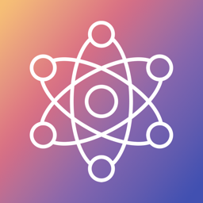
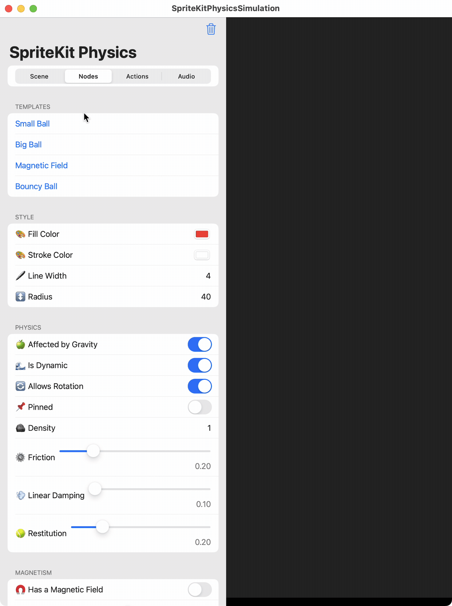

# SpriteKit Physics Simulator

This project is a SpriteKit Physics Playground built using SwiftUI, SpriteKit, and UIKit, allowing users to interact with a physics-based simulation in a customizable environment.

## Features
- Dynamic Gravity Control: Adjust gravityX and gravityY to set directional gravitational forces.
- Shape Customization: Modify object properties such as fill color, stroke color, line width, radius, and more.
- Physics Attributes: Configure physical behaviors including: Gravity, density, friction, linear damping, and restitution.
- Toggle options for dynamic motion, rotation allowance, and pinning.
- Magnetism Simulation: Enable a magnetic field on objects, adjusting strength as desired.
- Velocity Control: Set initial velocity to simulate motion in specified directions.

## Getting Started
- Download and Run the Xcode project

## Credits
- [App Icon by SAM Designs from Noun Project (CC BY 3.0)](https://thenounproject.com/browse/icons/term/physics/)

